---
## Front matter
title: "ЛАБОРАТОРНАЯРАБОТА № 2"
subtitle: "Система контроля версий Git"
author: "Карачевцева Елизавета Васильевна"

## Generic otions
lang: ru-RU
toc-title: "Содержание"

## Bibliography
bibliography: bib/cite.bib
csl: pandoc/csl/gost-r-7-0-5-2008-numeric.csl

## Pdf output format
toc: true # Table of contents
toc-depth: 2
lof: true #List of figures
fontsize: 12pt
linestretch: 1.5
papersize: a4
documentclass: scrreprt
## I18n polyglossia
polyglossia-lang:
  name: russian
  options:
	- spelling=modern
	- babelshorthands=true
polyglossia-otherlangs:
  name: english
## I18n babel
babel-lang: russian
babel-otherlangs: english
## Fonts
mainfont: PT Serif
romanfont: PT Serif
sansfont: PT Sans
monofont: PT Mono
mainfontoptions: Ligatures=TeX
romanfontoptions: Ligatures=TeX
sansfontoptions: Ligatures=TeX,Scale=MatchLowercase
monofontoptions: Scale=MatchLowercase,Scale=0.9
## Biblatex
biblatex: true
biblio-style: "gost-numeric"
biblatexoptions:
  - parentracker=true
  - backend=biber
  - hyperref=auto
  - language=auto
  - autolang=other*
  - citestyle=gost-numeric
## Pandoc-crossref LaTeX customization
figureTitle: "Рис."
tableTitle: "Таблица"
listingTitle: "Листинг"
lofTitle: "Список иллюстраций"
lolTitle: "Листинги"
## Misc options
indent: true
header-includes:
  - \usepackage{indentfirst}
  - \usepackage{float} # keep figures where there are in the text
  - \floatplacement{figure}{H} # keep figures where there are in the text
---

# Цель работы

Целью работы является изучить идеологию и применение средств контроля
версий. Приобрести практические навыки по работе с системой git.

# Выполнение лабораторной работы

1.1) Создадим учётную запись на сайте https://github.com/ и заполним основные данные

1.2) Сначала сделаем предварительную конфигурацию git. Откроем терминал и введём следующие команды, указав имя и email

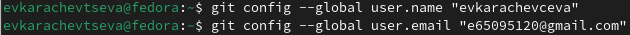{ #fig:001 width=70% }

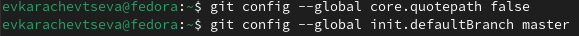{ #fig:002 width=70% }

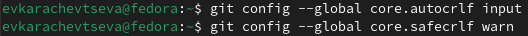{ #fig:003 width=70% }

1.3) Для последующей идентификации пользователя на сервере репозиториев необходимо сгенерировать пару ключей (приватный и открытый)

{ #fig:004 width=70% }

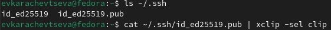{ #fig:005 width=70% }

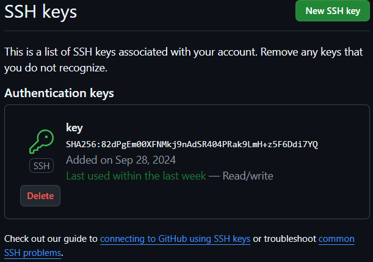{ #fig:006 width=70% }

1.4) Создадим каталог для предмета «Архитектура компьютера».

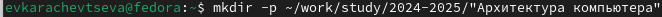{ #fig:007 width=70% }

1.5) Перейдём на станицу репозитория с шаблоном курса и создадим репозиторий study_2024–2025_arh-pc.Перейдём в каталог курса и клонируем созданный репозиторий

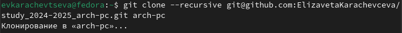{ #fig:008 width=70% }

1.6)Перейдём в каталог курса и удалим лишние файлы.

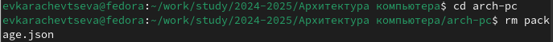{ #fig:009 width=70% }

1.7)Создадим необходимые каталоги.

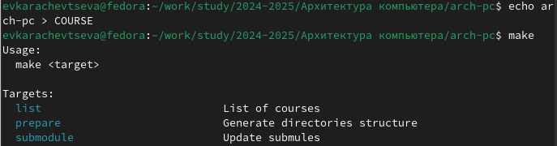{ #fig:010 width=70% }

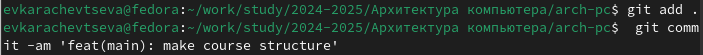{ #fig:011 width=70% }

{ #fig:012 width=70% }

1.8) Проверим правильность создания иерархии рабочего пространства в локальном репозитории и на странице github.

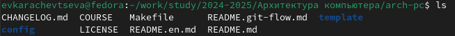{ #fig:013 width=70% }

# Выполнение самостоятельной работы.

3.1. Создадим отчет по выполнению лабораторной работы в соответствующем каталоге рабочего пространства . 

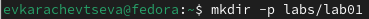{ #fig:014 width=70% }

3.1’. Перенесём отчеты по выполнению лабораторной работы в соответствующие каталоги созданного рабочего пространства.

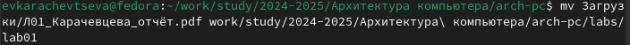{ #fig:015 width=70% }

3.1”. Загрузим файлы на github.

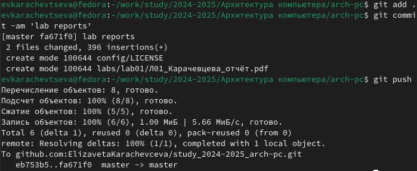{ #fig:016 width=70% }

# Вывод

В ходе данного практикума была успешно освоена система контроля версий
Git и платформа GitHub. Мы научились применять основные функции работы с
github( команды init, pull, push, ststus, diff, add ., add, rm, commit
-am, checkout --b, checkout, push, branch)

::: {#refs}
:::
