---
## Front matter
title: "ЛАБОРАТОРНАЯ РАБОТА № 3"
subtitle: "Язык разметки Markdown"
author: "Карачевцева Елизавета Васильевна"

## Generic otions
lang: ru-RU
toc-title: "Содержание"

## Bibliography
bibliography: bib/cite.bib
csl: pandoc/csl/gost-r-7-0-5-2008-numeric.csl

## Pdf output format
toc: true # Table of contents
toc-depth: 2
lof: true #List of figures
fontsize: 12pt
linestretch: 1.5
papersize: a4
documentclass: scrreprt
## I18n polyglossia
polyglossia-lang:
  name: russian
  options:
	- spelling=modern
	- babelshorthands=true
polyglossia-otherlangs:
  name: english
## I18n babel
babel-lang: russian
babel-otherlangs: english
## Fonts
mainfont: PT Serif
romanfont: PT Serif
sansfont: PT Sans
monofont: PT Mono
mainfontoptions: Ligatures=TeX
romanfontoptions: Ligatures=TeX
sansfontoptions: Ligatures=TeX,Scale=MatchLowercase
monofontoptions: Scale=MatchLowercase,Scale=0.9
## Biblatex
biblatex: true
biblio-style: "gost-numeric"
biblatexoptions:
  - parentracker=true
  - backend=biber
  - hyperref=auto
  - language=auto
  - autolang=other*
  - citestyle=gost-numeric
## Pandoc-crossref LaTeX customization
figureTitle: "Рис."
tableTitle: "Таблица"
listingTitle: "Листинг"
lofTitle: "Список иллюстраций"
lolTitle: "Листинги"
## Misc options
indent: true
header-includes:
  - \usepackage{indentfirst}
  - \usepackage{float} # keep figures where there are in the text
  - \floatplacement{figure}{H} # keep figures where there are in the text
---

# Цель работы

Целью работы является освоение основных навыков для работы с легковесным языком разметки Markdown.

# Выполнение лабораторной работы

1.1) Перейдем в каталог курса сформированный при выполнении лабраторной работы №2.

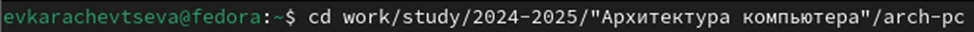{ #fig:001 width=70% }

1.2) Обновим локальный репозиторий.

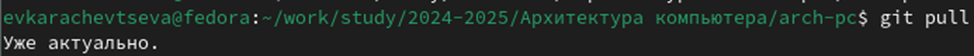{ #fig:002 width=70% }

1.3) Перейдем в каталог с шаблоном отчёта по лабораторной работе №3.

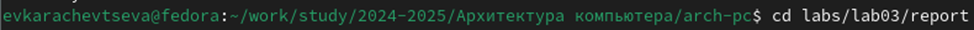{ #fig:003 width=70% }

1.4) Проведём компиляцию с использованием Makefile.

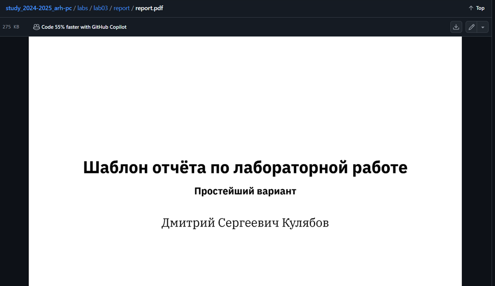{ #fig:004 width=70% }

1.4') Проверим корректность полученых файлов.

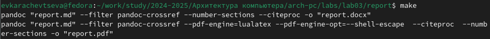{ #fig:005 width=70% }

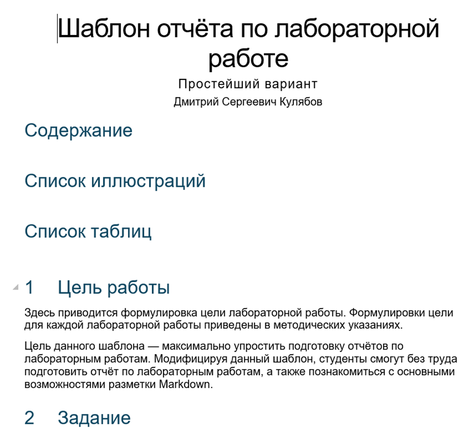{ #fig:006 width=70% }

1.5) Удалим полученные файлы.

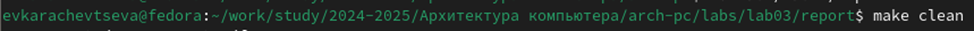{ #fig:007 width=70% }

1.5') Проверим что файлы были удалены.

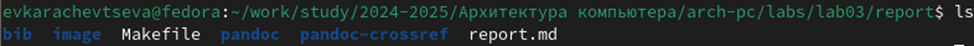{ #fig:008 width=70% }

1.6) Откроем файл report.md и внимательно изучим структуру этого файла.

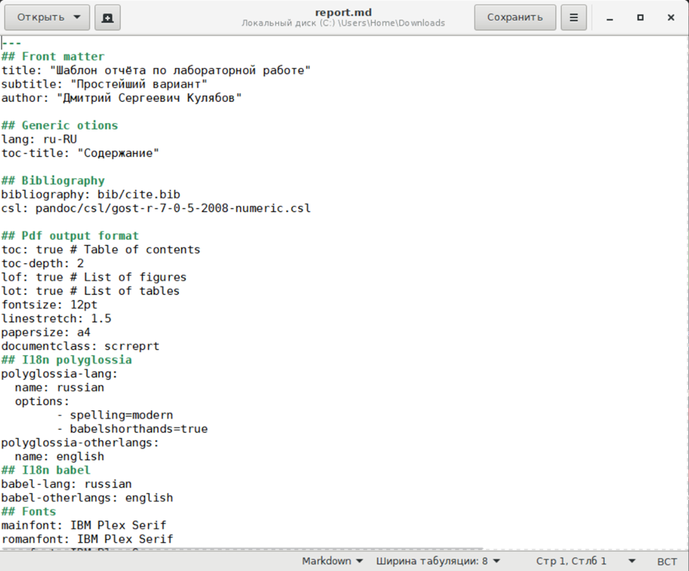{ #fig:009 width=70% }

1.7)Заполним отчёт с использованием Makefile и проверим корректность полученных файлов.

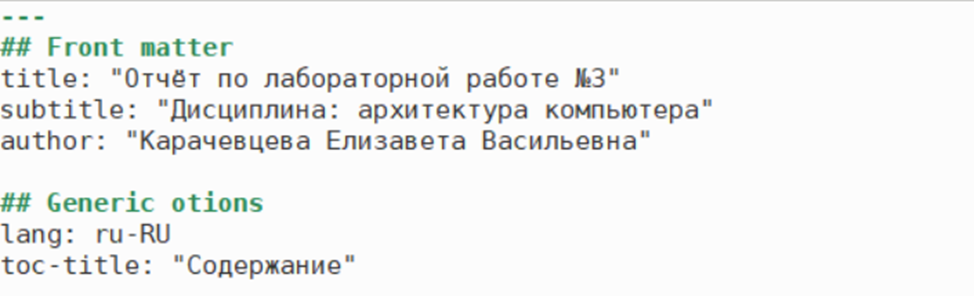{ #fig:010 width=70% }

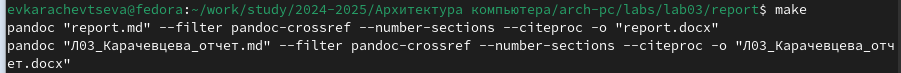{ #fig:011 width=70% }

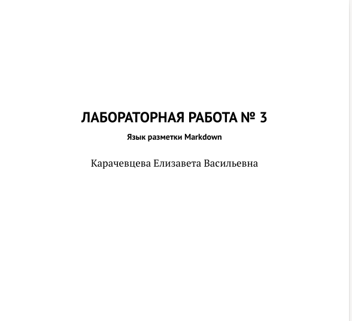{ #fig:012 width=70% }

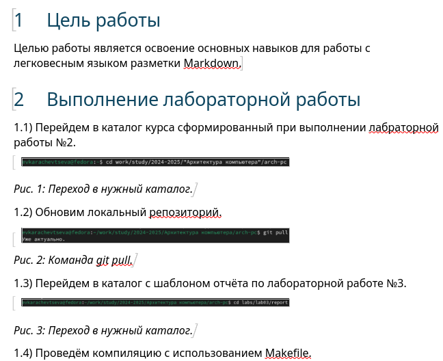{ #fig:013 width=70% }

1.8) Загрузим файлы на Github.

# Выполнение самостоятельной работы.

2.1. Перейдем в каталог для заполнения отчётов к лабораторной работе №2. 

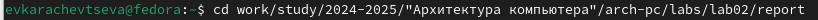{ #fig:015 width=70% }

2.2. Заполнение отчёта ко второй лабораторной работе в md формате.

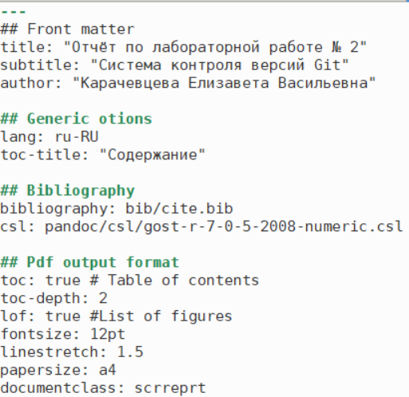{ #fig:016 width=70% }

2.3. Испльзование Makefile.

{ #fig:017 width=70% }

2.4. Отправка файлов на Github.

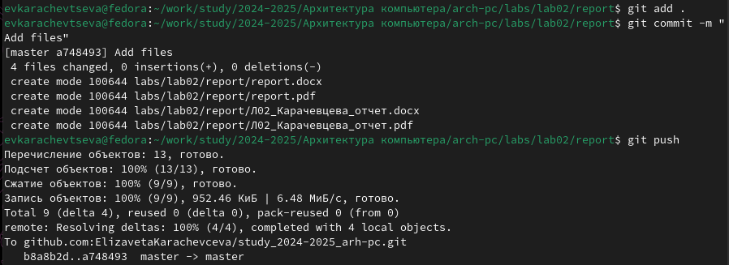{ #fig:018 width=70% }

2.5. Проверка полученных файлов.

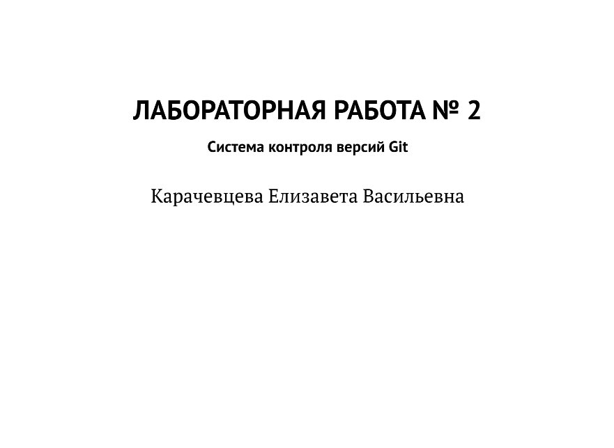{ #fig:019 width=70% }

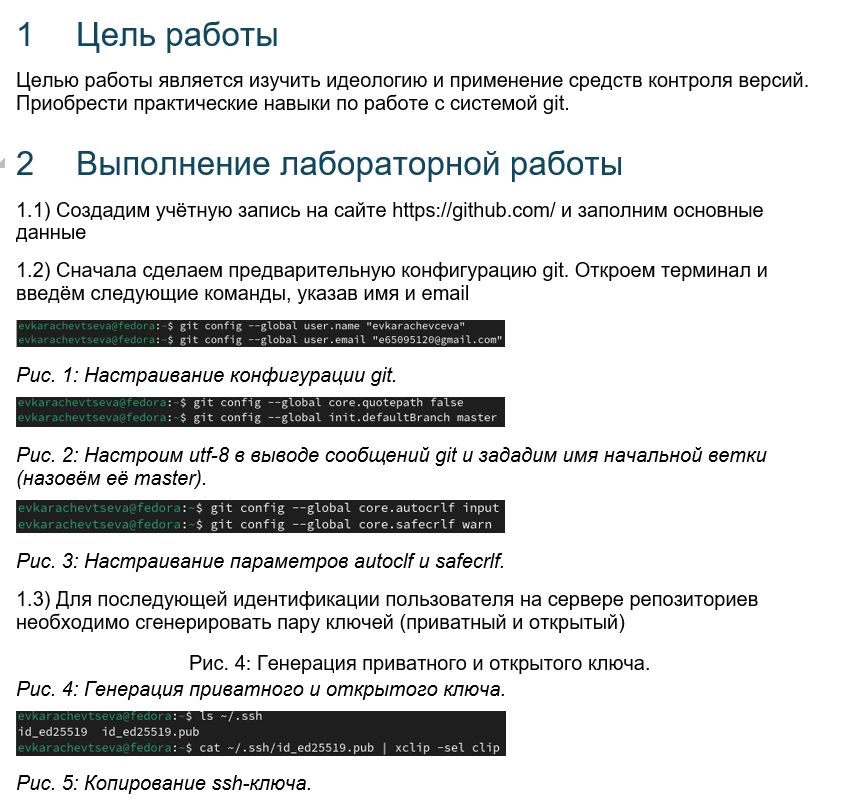{ #fig:020 width=70% }

# Вывод

В ходе данного практикума были освоены процедуры оформления отчётов с помощью легковесного языка разметки Markdown.

::: {#refs}
:::
