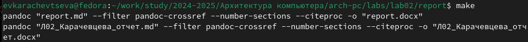

---
## Front matter
title: "Отчет по лабораторной работе №3"
subtitle: "Язык разметки Markdown"
author: "Карачевцева Елизавета Васильевна"

## Generic otions
lang: ru-RU
toc-title: "Содержание"

## Bibliography
bibliography: bib/cite.bib
csl: pandoc/csl/gost-r-7-0-5-2008-numeric.csl

## Pdf output format
toc: true # Table of contents
toc-depth: 2
lof: true # List of figures
lot: true # List of tables
fontsize: 12pt
linestretch: 1.5
papersize: a4
documentclass: scrreprt
## I18n polyglossia
polyglossia-lang:
  name: russian
  options:
	- spelling=modern
	- babelshorthands=true
polyglossia-otherlangs:
  name: english
## I18n babel
babel-lang: russian
babel-otherlangs: english
## Fonts
mainfont: IBM Plex Serif
romanfont: IBM Plex Serif
sansfont: IBM Plex Sans
monofont: IBM Plex Mono
mathfont: STIX Two Math
mainfontoptions: Ligatures=Common,Ligatures=TeX,Scale=0.94
romanfontoptions: Ligatures=Common,Ligatures=TeX,Scale=0.94
sansfontoptions: Ligatures=Common,Ligatures=TeX,Scale=MatchLowercase,Scale=0.94
monofontoptions: Scale=MatchLowercase,Scale=0.94,FakeStretch=0.9
mathfontoptions:
## Biblatex
biblatex: true
biblio-style: "gost-numeric"
biblatexoptions:
  - parentracker=true
  - backend=biber
  - hyperref=auto
  - language=auto
  - autolang=other*
  - citestyle=gost-numeric
## Pandoc-crossref LaTeX customization
figureTitle: "Рис."
tableTitle: "Таблица"
listingTitle: "Листинг"
lofTitle: "Список иллюстраций"
lotTitle: "Список таблиц"
lolTitle: "Листинги"
## Misc options
indent: true
header-includes:
  - \usepackage{indentfirst}
  - \usepackage{float} # keep figures where there are in the text
  - \floatplacement{figure}{H} # keep figures where there are in the text
---

# Цель работы

Целью работы является освоение основных навыков для работы с легковесным языком разметки Markdown.

# Задание

1) Заполнение отчета по лабораторной работе №3 с помощью легковесного языка разметки Markdown.
2) Задание для самостоятельной работы

# Теоретическое введение

Markdown - легковесный язык разметки, созданный с целью обозначения форматирования в простом тексте, с максимальным сохранением его читаемости человеком, и пригодный для машинного преобразования в языки для продвинутых публикаций. Внутритекстовые формулы делаются аналогично формулам LaTeX.
В Markdown вставить изображение в документ можно с помощью непосредственного указания адреса изображения.Синтаксис Markdown для встроенной ссылки состоит из части [link text], представляющей текст гиперссылки, и части (file-name.md) – URL-адреса или имени файла, на который дается ссылка.
Markdown поддерживает как встраивание фрагментов кода в предложение, так и их размещение между предложениями в виде отдельных огражденных блоков. Огражденные блоки кода — это простой способ выделить синтаксис для фрагментов кода.

# Выполнение лабораторной работы

1.1) Перейдем в каталог курса сформированный при выполнении лабраторной работы №2.

{ #fig:001 width=70% }

1.2) Обновим локальный репозиторий.

{ #fig:001 width=70% }

1.3) Перейдем в каталог с шаблоном отчёта по лабораторной работе №3.

{ #fig:002 width=70% }

1.4) Проведём компиляцию с использованием Makefile.

{ #fig:003 width=70% }

1.4') Проверим корректность полученых файлов.

{ #fig:003 width=70% }

{ #fig:003 width=70% }

1.5) Удалим полученные файлы.

{ #fig:003 width=70% }

1.5') Проверим что файлы были удалены.

{ #fig:004 width=70% }

1.6) Откроем файл report.md и внимательно изучим структуру этого файла.

{ #fig:004 width=70% }

1.7)Заполним отчёт с использованием Makefile и проверим корректность полученных файлов.

{ #fig:004 width=70% }

{ #fig:004 width=70% }

# Выполнение самостоятельной работы.

2.1. Перейдем в каталог для заполнения отчётов к лабораторной работе №2. 

{ #fig:014 width=70% }

2.2. Заполнение отчёта ко второй лабораторной работе в md формате.

{ #fig:015 width=70% }

2.3. Испльзование Makefile.

{ #fig:016 width=70% }

2.4. Отправка файлов на Github.

{ #fig:016 width=70% }

2.5. Проверка полученных файлов.

{ #fig:016 width=70% }

{ #fig:016 width=70% }

# Выводы

В ходе данного практикума были освоены процедуры оформления отчётов с помощью легковесного языка разметки Markdown.

::: {#refs}
:::
